## GoAccess report. Using "22-10-1970.log" log file as an example

### Terminal Output:

#### 1. Visitors:
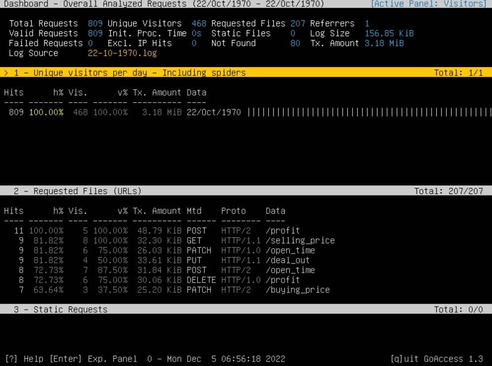

#### 2. Requests:
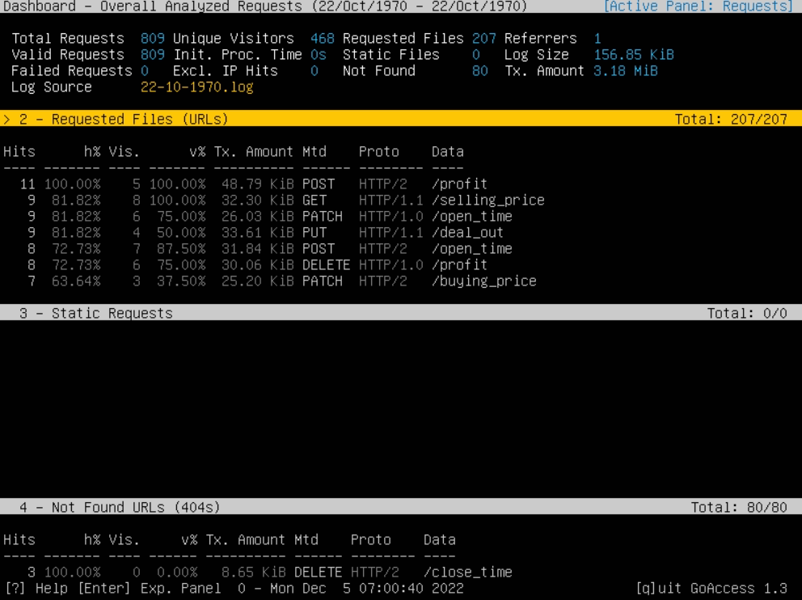

#### 3. Static_Requests:
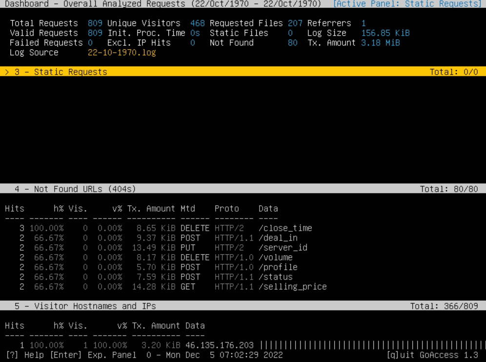

#### 4. Not found URLs:
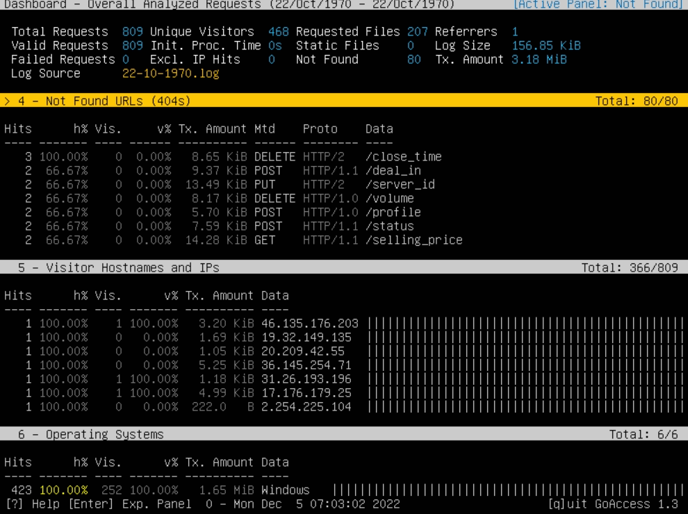

#### 5. Visitor Hostnames and IPs:
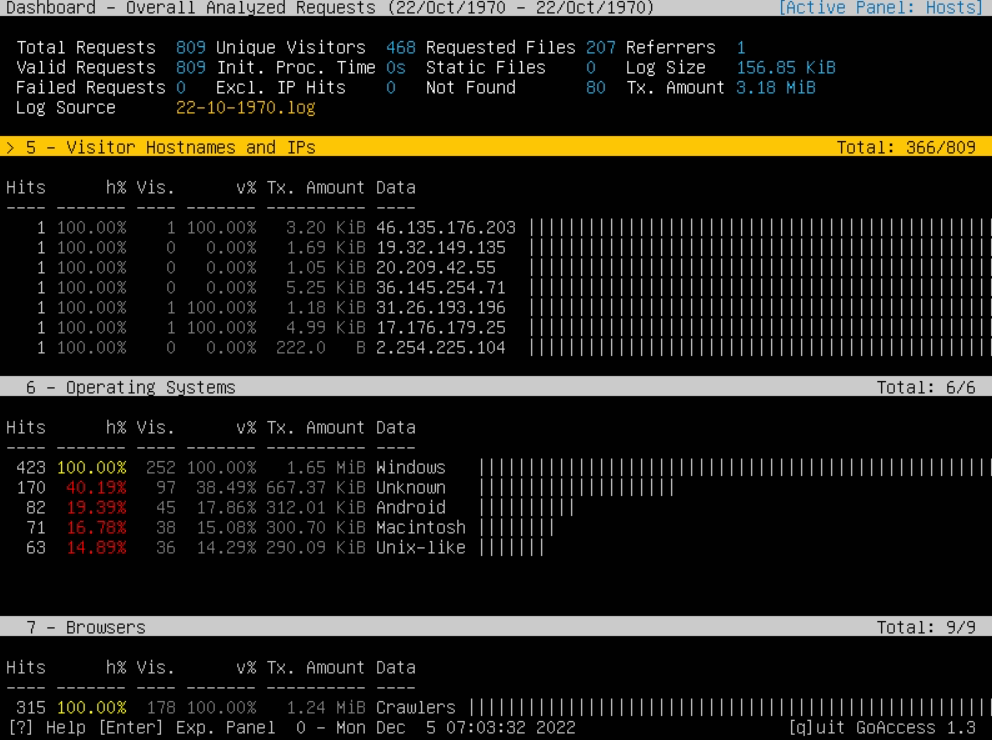

#### 6. Operating systems:
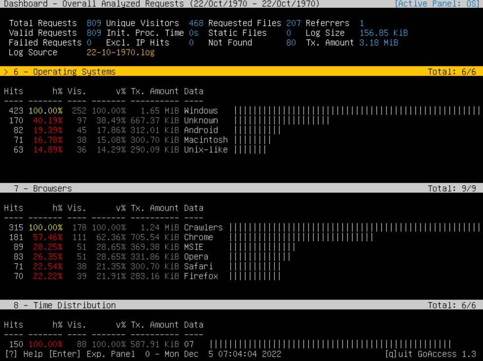

#### 7. Browsers:
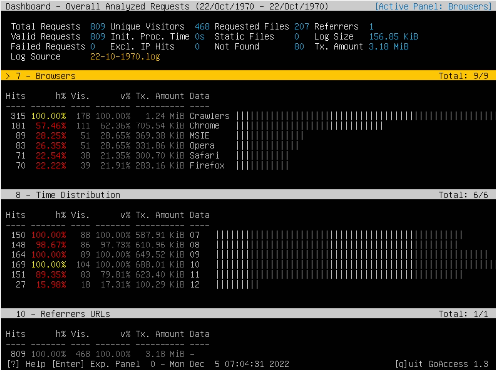

#### 8. Time Distribution:
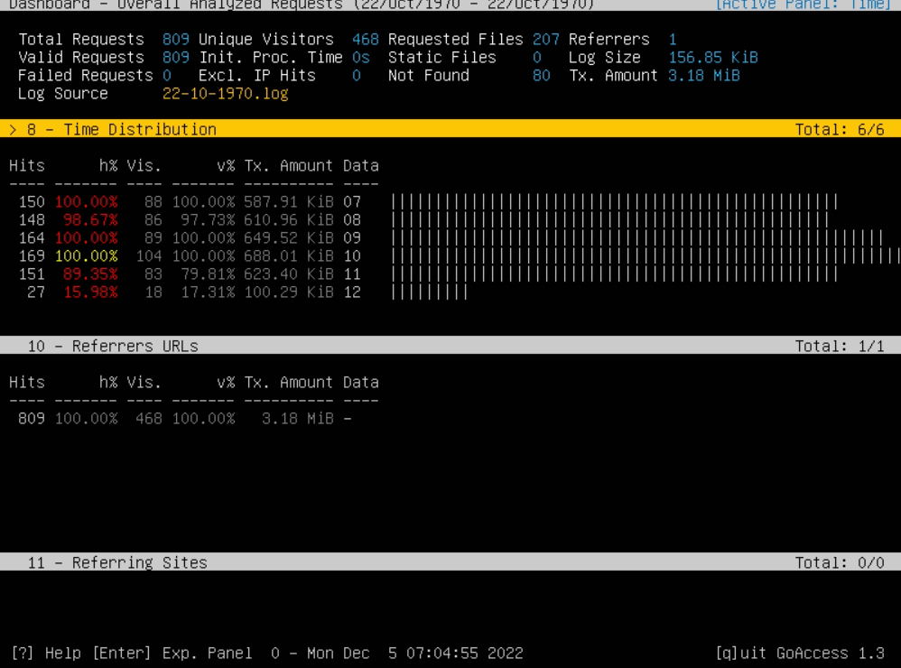

#### 10. Referrers URLs:
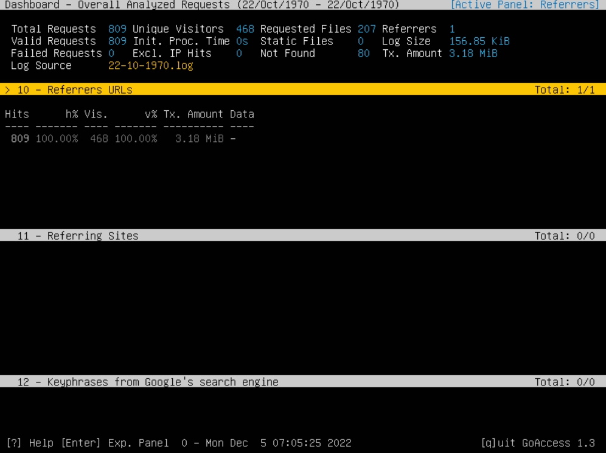

#### 13. Referrers URLs:
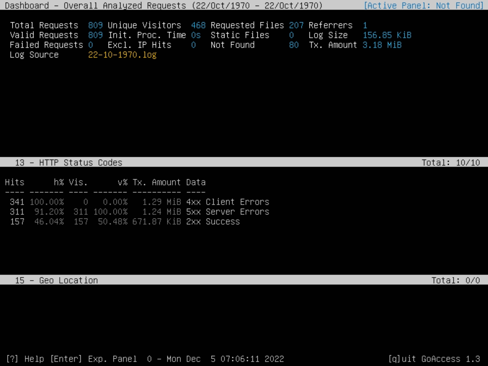

### Static HTML Output (attached as the file "report.html" in this directory):

#### 1. HTML Output:
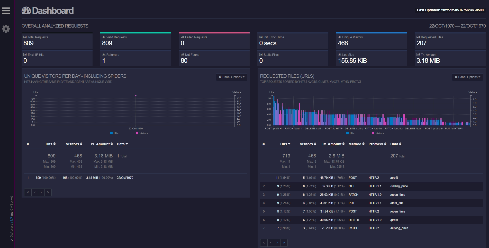

#### 2. HTML Output:
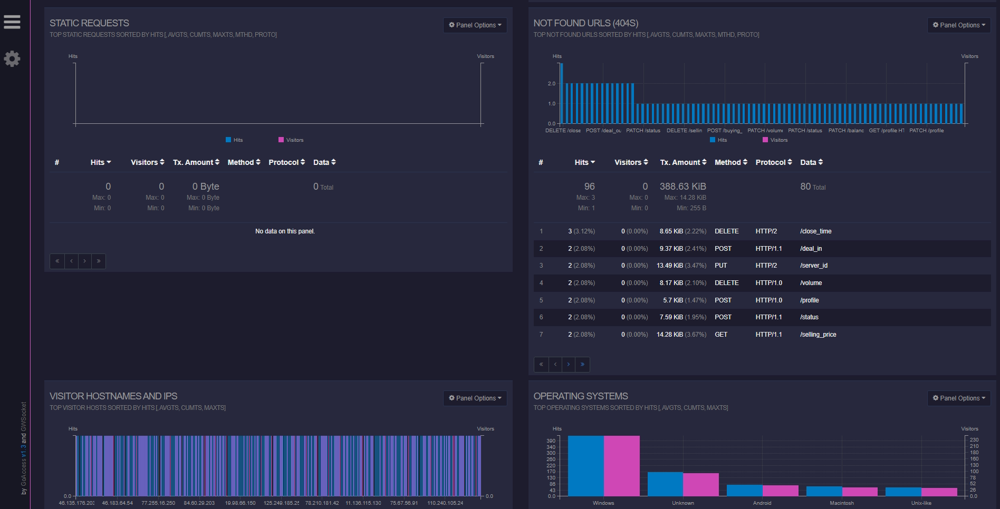

#### 3. HTML Output:
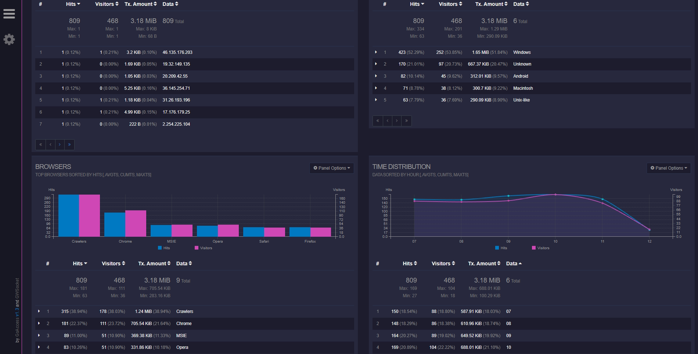

#### 4. HTML Output:
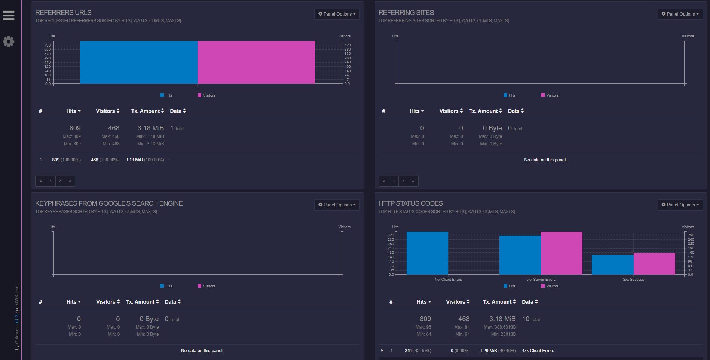
